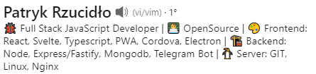
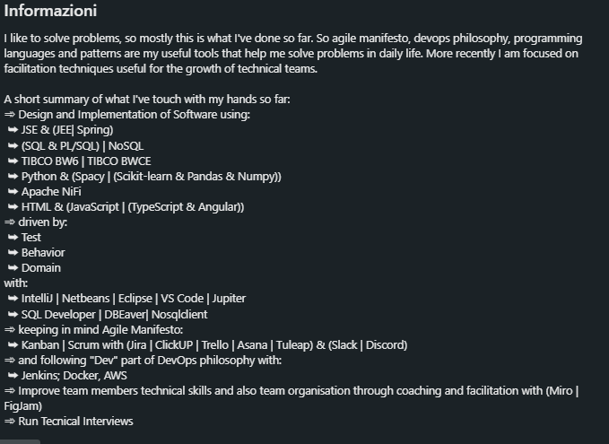

# Guida Galattica al profilo LinkedIn

_Benvenuto/a in questa guida per ottimizzare il tuo profilo LinkedIn! Esattamente come la guida al CV (che trovi <a href="https://guidopenta.github.io/galactic-CV-guide/">qui</a> ) l'obiettivo è quello di darti degli spunti utili per rendere il tuo profilo LinkedIn attrattivo ma soprattutto "keyword-friendly". Essendo un social network professionale, lo scopo della guida è semplice: farti trovare (sempre che, ovviamente, tu voglia farti trovare 😜 )! Se non sei in cerca di lavoro, questa guida può comunque esserti utile per meglio posizionare il tuo profilo, renderlo più professionale e può fornirti qualche spunto e curiosità._

> [English version](./english.md)

## Indice 

1. [Indicazioni generali](#1-indicazioni-generali)
2. [Foto profilo e foto copertina](#2-foto-profilo-e-foto-copertina)
3. [La Headline](#3-la-headline)
4. [Sezione Informazioni (about me)](#4-sezione-informazioni-about-me)
5. [Le esperienze professionali](#5-le-esperienze-professionali)
6. [La formazione](#6-la-formazione)
7. [Licenze e certificazioni](#7-licenze-e-certificazioni)
8. [Competenze](#8-competenze)
9. [Lingue](#9-lingue)
10. [Referenze](#10-referenze)
11. [Considerazioni-finali](#11-considerazioni-finali)

## 1) Indicazioni generali

LinkedIn, nel mondo, conta circa 830 milioni di utenti attivi, di cui circa 16 milioni in Italia. Per il settore tech è, senza dubbio, lo strumento migliore che le persone che lavorano come recruiter/head hunters/talent acquisition usano tutti i giorni per trovare professionisti/e del settore IT.
Prima di scendere nel dettaglio dei vari punti della guida, alcune considerazioni generali per iniziare al meglio:
- Lo so, moltissimi recruiter non conoscono il tuo gergo, i nomi delle tecnologie/framework, confondono Java con JavaScript (si, succede ancora) e così via. E questo, immagino, ti fa incazzare. MA, ti prego, cerca comunque di essere sempre comprensivo ed empatico verso chi ti scrive. Cerca, per quanto possibile, di rispondere sempre ai messaggi che ricevi perché dall'altra parte c'è comunque una persona che sta lavorando e che merita rispetto esattamente come lo meriti tu. Se al momento non sei in cerca di un nuovo lavoro, ti consiglio magari di prepararti un testo preimpostato da inviare a chi ti scrive, da usare banalmente come risposta. Tu perdi pochi secondi di tempo ma ti assicuro che chi c'è dall'altra parte apprezzerà!
- La questione dell'opentowork: sicuramente penserai che la cornice verde #opentowork non sia un granché, vero? E pensi anche che, se la attivi, la tua azienda ti sgamerà subito e capirà che stai cercando un nuovo lavoro. Non so se lo sai, ma c'è anche la possibilità di segnalare che sei opentowork ma non al "pubblico": basta cliccare sul tasto "disponibile per" sotto la foto profilo e, dopo aver selezionato l'opzione "cambiare lavoro" nella maschera che ti si aprirà, scorri in basso e troverai un menù con il titolo "scegli chi può vedere che sei disponibile per opportunità di lavoro" e seleziona "solo recruiter": in questo modo i recruiter, utilizzando Linkedin Recruiter, vedranno una voce nel tuo profilo "disponibile a lavorare". Easy!
- Chi cerca professionisti su Linkedin lo fa principalmente utilizzando le keyword (parole chiave), in due modi: o usando le stringhe booleane (sei un dev, penso sia inutile spiegarti cosa siano) o usando appunto le parole chiave ed altri filtri con la licenza LinkedIn Recruiter (il profilo a pagamento di Linkedin che sblocca tutta una serie di funzionalità, fra cui tantissimi filtri di ricerca ottimizzata e molto altro). Da qui si intuisce che TUTTO ciò che è scritto sul tuo profilo è utile a farti trovare e, soprattutto, a rientrare in modo mirato nelle ricerche che vengono effettuate sulla piattaforma proprio tramite le parole chiave. Approfondiremo comunque questo aspetto nelle sezioni successive della guida.
- LinkedIn, come ogni altro social network, ha un proprio algoritmo che regola cosa ti appare nel feed, le interazioni fra iscritti e molto altro. Per mantenere un profilo visibile ed "engaging" molte guide online consigliano di postare 3-4 contenuti a settimana e di lasciare almeno due commenti al giorno. Questa, almeno, sarebbe la golden rule per tenere un profilo "amico" dell'algoritmo. Detto questo, sei libero di utilizzare il tuo profilo come meglio credi: se non hai nulla di interessante da postare, non devi farlo per forza! Il grandissimo pregio di LinkedIn è dato proprio dai contenuti di valore che vengono postati. Io, ad esempio, posto poco (in media, una volta a settimana) ma in compenso commento molto e tengo vive le tante relazioni sulla piattaforma (anche i messaggi privati "attivano" l'algoritmo, lo sapevi?). Trova quindi il tuo personale "tone of voice" ed adattalo a quello che vuoi comunicare. E ricorda: anche non comunicare è comunicare 😁.

  <b><a href="#indice">↥ Back To Top</a></b>

## 2) Foto profilo e foto copertina

Rispetto al CV, su LinkedIn la foto profilo è FONDAMENTALE (uno studio rivela che chi ha una foto profilo professionale ha 20x visualizzazioni del profilo rispetto a chi non ne ha). Usane una professionale (NO foto sgranate, NO fototessere di 20 anni fa, NO foto al mare..insomma hai capito), ti prego. Come ho scritto nella guida al CV, se non hai una foto anche un avatar o una illustrazione vanno bene. Ma anche qui, che siano professionali, non fatte con Paint, ecco.
Riguardo l'immagine di copertina: non è a mio avviso fondamentale ma io la sfrutterei per dare un tocco di personalizzazione al tuo profilo: un pezzettino di codice? Una quote famosa? Un meme? Ecco, puoi usare l'immagine di copertina per "trasmettere qualcosa" a chi visita il tuo profilo. Sfruttala!

  <b><a href="#indice">↥ Back To Top</a></b>

## 3) La headline

Immediatamente dopo aver settato la foto profilo e l'immagine di copertina, bisogna porre la massima attenzione a quest'altra importantissima sezione, ovvero la headline: è la sezione testuale che si trova immediatamente sotto la foto, che di norma comprende il sommario e la posizione lavorativa attuale.
Nell'immagine sottostante trovate un ottimo esempio, ovvero la headline di Patryk: un developer molto attivo su Linkedin e che a mio avviso ha un profilo estremamente curato in tutti i suoi dettagli.

  <b><a href="#indice">↥ Back To Top</a></b>

Ma perché la sua headline funziona? Semplice: fornisce in maniera veloce ma efficace una overview prima di tutto dello stack tecnologico che utilizza e conosce (nel suo caso sia per la parte FE che per la parte BE) ma anche un ulteriore spunto riguardo la sua passione per l'open source.
Inoltre, e questa è una cosa importantissima, tutte le tecnologie/framework che ha inserito nella headline sono delle keyword (ricordi? Ne abbiamo parlato nell'introduzione) quindi, ad esempio, ricercando un dev che conosca sia TypeScript che React, i recruiter capiteranno sicuramente sul profilo di Patryk perché quel testo nella headline funge da parola chiave. 
A prescindere dalle keyword, la headline è a colpo d'occhio una delle primissime cose che si notano sul profilo: è uno spazio dove devi riuscire a comunicare in poche righe chi sei, cosa fai (ed eventualmente, cosa cerchi). Sfruttala AL MASSIMO!

  <b><a href="#indice">↥ Back To Top</a></b>

## 4) Sezione informazioni

Esattamente come l'about me sul curriculum, questa sezione sul tuo profilo è utilissima per fornire una overview approfondita delle tue esperienze lavorative, i linguaggi/tecnologie/framework che conosci e che utilizzi, obiettivi futuri, attività che segui giornalmente e perché no, anche informazioni che potrebbero sembrare poco utili (hobbies, cosa ti piace fare nel tempo libero, i libri che stai leggendo, le persone che segui, i progetti che sviluppi nel tempo libero) ma che forniscono a chi legge una vista più completa e dettagliata su di te. 
Ti riporto un esempio di una sezione informazioni estremamente dettagliata di un senior dev che ho fra i contatti:

La sezione informazioni, così come compilata nell'esempio, contiene tutte le informazioni che servono ad un/una recruiter: una breve descrizione di sè e dell'approccio al lavoro, un elenco esaustivo di tecnologie/linguaggi/framework/software/metodologie (ed indovinate un po'? SONO TUTTE KEYWORD! ) ed anche ulteriori input riguardo la gestione del team, la capacità di seguire colloqui tecnici e l'abitudine al lavoro Agile. Prendi spunto!

  <b><a href="#indice">↥ Back To Top</a></b>

## 5) Le esperienze professionali

Che dire di questa sezione? È in assoluto una delle più importanti dell'intero profilo (se non LA più importante). Alcuni spunti utili a riguardo:
- Cerca di sfruttare al massimo il campo "Descrizione" quando inserisci o modifichi una esperienza lavorativa. Ormai avrai capito che tutto il testuale sul profilo fa parola chiave, quindi sfrutta questo campo per descrivere brevemente cosa fai in azienda, le mansioni, i task giornalieri, le tecnologie ed il settore lavorativo dell'azienda per la quale lavori.
- Aggancia alla posizione lavorativa le competenze: lo vedremo nella sezione dedicata più avanti, ma scrivere le competenze sul profilo è FONDAMENTALE per farsi trovare dai recruiter. Agganciare quindi le competenze al lavoro che si sta svolgendo (o si è svolto in precedenza) è utilissimo per dimostrare uno "storico" professionale coerente con quello che fai attualmente o con quello che hai fatto in precedenza.
- Cerca di "agganciare" correttamente il nome dell'azienda per la quale lavori. Spesso trovo profili con palesi errori di battitura riguardo l'azienda per la quale si lavora, di conseguenza LinkedIn non mostra il logo corretto dell'azienda. Ne consegue che un recruiter che, ad esempio, voglia andare a leggere di cosa si occupa l'azienda, il settore, le dimensioni ed altro, banalmente non potrà farlo. Poni quindi attenzione a selezionare correttamente l'azienda per la quale lavori, è importantissimo!
- Content is king: sarò ridondante ma più informazioni scrivi sul profilo meglio é: meglio un profilo ben curato, con tante informazioni, che uno scarno e vuoto. Ti assicuro che l'effort sulla compilazione del proprio profilo viene notato!

  <b><a href="#indice">↥ Back To Top</a></b>

## 6) La formazione

La sezione del profilo LinkedIn dedicata alla formazione viene spesso tralasciata, ma in realtà è importante tanto quanto le altre sezioni. È una delle sezioni, infatti, che viene "letta" dai vari filtri di Linkedin Recruiter nel momento in cui i recruiter impostano una ricerca mirata (ad esempio: uno specifico titolo di studio, una particolare università o uno specifico indirizzo). Quindi presta molta attenzione a questa sezione e compilala in maniera esaustiva. Inserisci quindi il nome della facoltà, l'indirizzo scelto, il voto di laurea, ed i nomi degli esami che a tuo avviso potrebbero essere affini al tuo percorso professionale. 

Se stai frequentando una Academy/Bootcamp IT, ovviamente inserirlo ti farà apparire come studente di quella academy, e sicuramente aiuta nell'indicizzazione del tuo profilo (anche perché, scrivendo le parole chiave relative alle tecnologie/linguaggi che stai studiando, inserisci ulteriori parole chiave sul tuo profilo che, come avrai capito, sono fondamentali).

  <b><a href="#indice">↥ Back To Top</a></b>

## 7) Licenze e certificazioni

Personalmente, è una delle sezioni che leggo con più interesse e curiosità sui profili Linkedin che visito (ma io sono un animale strano, adoro leggere la sezione hobby sul CV quindi probabilmente faccio poco testo). Nota bene: non sono un tecnico, di conseguenza non riesco a carpire il reale "valore tecnico" di una certificazione *x* piuttosto che *y* ma, il fatto di avere certificazioni, attestati e licenze denota un certo approccio alla auto-formazione che a mio avviso è un plus. Ok, alcune aziende richiedono obbligatoriamente delle certificazioni (penso ad esempio alla Green Belt Six Sigma, ormai imprescindibile per le basi di un buon Project Manager, o le certificazioni cloud AWS/Azure/Google Cloud) per accedere alle loro selezioni o per un avanzamento di carriera, e questo ci sta. 

Ma molto spesso, invece, non c'è alcun obbligo per un/una professionista di certificarsi e formarsi, sta semplicemente alla volontà del singolo di accrescere le proprie competenze e conoscenze in maniera "ufficiale", con un certifcato o una specifica licenza. Questo, personalmente, lo apprezzo moltissimo e lo trovo un ottimo spunto di conversazione durante i colloqui. Di conseguenza, questa sezione è assolutamente adatta per mettere in mostra la tua propensione all'apprendimento ed alla tua crescita professionale.

  <b><a href="#indice">↥ Back To Top</a></b>

## 8) Competenze

Una cosa che noto SPESSISSIMO sui profili LinkedIn che visito giornalmente è la scarsa cura di questa sezione, che in realtà è SUPER SUPER importante, assieme alla sezione sulle esperienze professionali. Qual è la parola di cui ho ampiamente abusato in questa guida? KEYWORD. Ecco, è esattamente la sezione competenze che alimenta in maniera decisamente importante il vostro comparire (o meno) fra le ricerche dei recruiter.

La sezione competenze DEVE essere curata e tenuta in ordine per vari motivi, ti spiego come:
- Aggiorna costantemente la sezione, eliminando tecnologie/linguaggi/framework che non usi più (o che conosci ma non vuoi più utilizzare professionalmente) per evitare di ricevere proposte di lavoro con tecnologie che non ti interessano.
- Una cosa importantissima è ordinare le competenze: metti in cima le competenze sulle quali sei più forte e alla fine quelle dove ti senti meno competente.
- LinkedIn ti dà la possibiltità di mettere "in evidenza" la tua top three di competenze, che appariranno subito sul tuo profilo: ricollegandomi quindi al punto precedente, scegli le tre competenze dove ti senti più skillato e spostale in alto.
- Avevamo parlato delle competenze anche nel punto 5, le esperienze professionali: LinkedIn ti permette di "legare" le competenze all'esperienza professionale, super utile per dimostrare che competenze stai utilizzando nell'attuale ruolo che ricopri.
- Chiedi a colleghi/amici/collegamenti di confermarti le competenze: è ovviamente una pura vanity metric ma probabilmente sai meglio di me che "l'effetto wow" di vedere una competenza confermata da tante persone funziona, quindi fallo!

  <b><a href="#indice">↥ Back To Top</a></b>

## 9) Lingue

Esattamente come per il CV, la sezione lingue fornisce la possibilità di comunicare la tua conoscenza di una o più lingue che non siano la madrelingua (nel nostro caso, ovviamente, l'italiano). Mi capita ad esempio di gestire selezioni dove è assolutamente obbligatoria la conoscenza dell'inglese (perché magari il team è internazionale, l'azienda ha clienti esteri, si sta espandendo fuori dall'Italia, etc.), di conseguenza dimostrare una conoscenza di una lingua straniera mi aiuta a capire se il profilo che sto visitando soddisfa quel requisito. 
Se hai certificazioni o attestati di lingua, è assolutamente ottima cosa inserirli nella sezione di cui abbiamo parlato prima, ovvero "Licenze e certificazioni".

  <b><a href="#indice">↥ Back To Top</a></b>

## 10) Referenze

Ecco un'altra sezione che adoro visitare (sì, sono strano, questo lo conferma). Le recensioni sono un'arma potentissima che davvero in pochissimi sfruttano. È impossibile non avere un collega, manager, ex-capo, collaboratore, consulente esterno al quale poter chiedere una referenza (a meno che tu non sia il Grinch e non abbia amici, ovviamente). È davvero una richiesta che costa pochi minuti ed aiuta tantissimo ad arricchire il tuo profilo ed ad aumentare il tuo personal branding.

Fun fact: mentre visitavo un profilo di un developer (che, a prima vista, non mi convinceva particolarmente) ho notato che aveva ricevuto una referenza da un manager di alto livello che conosco bene. La referenza mi ha quindi spinto ad indagare maggiormente, contattando il developer che, infatti, durante il colloquio ha confermato l'attitudine e le skill che riportava la referenza positiva che aveva ricevuto dal manager. Probabilmente, se non ci fosse stata quella referenza, non lo avrei mai contattato!

  <b><a href="#indice">↥ Back To Top</a></b>

## 11) Considerazioni finali

Se sei arrivato fin qui ti ringrazio, perché come puoi notare il dono della sintesi non mi appartiene (probabilmente lo avrai notato anche leggendo la guida al CV, che è ancora più lunga di questa). In realtà, per dovere di cronaca, ho volontariamente omesso moltissimi altri temi e funzionalità di LinkedIn a mio avviso interessanti ed estremamente utili (chi ti ha visitato il profilo, le visualizzazioni organiche dei post, l'uso degli hashtag, il profilo creator, l'algoritmo, il link nel post e nei commenti e molto altro ancora), ma l'ho fatto semplicemente per un motivo pratico, ovvero cercare di non appesantire questa guida con eccessivo nozionismo o tecnicismi verticali della piattaforma.
Lo so, sei un dev, tu nei tecnicismi probabilmente ci sguazzi, ed hai anche ragione! Ma, ecco, l'obiettivo è rendere fruibili e "leggere" queste guide senza scendere troppo nel tecnico e scadere nella noia più totale.

Se non ti sei addormentato, grazie di nuovo!

  <b><a href="#indice">↥ Back To Top</a></b>

