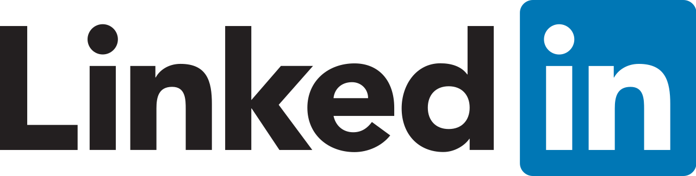

# Guida Galattica al profilo LinkedIn

_Benvenuto/a in questa guida per ottimizzare il tuo profilo LinkedIn! Esattamente come la guida al CV (che trovi <a href="https://guidopenta.github.io/galactic-CV-guide/">qui</a> ) l'obiettivo è quello di darti degli spunti utili a rendere il tuo profilo LinkedIn attrattivo ma soprattutto "keyword-friendly". Essendo un social network professionale, lo scopo della guida è semplice: farti trovare!_

## Indice 

1. [Indicazioni generali](#1-indicazioni-generali)
2. [Foto profilo e foto copertina](#2-foto-profilo-e-foto-copertina)
3. [Sezione Intro ed Headline](#3-sezione-intro-ed-headline)
4. [Post in primo piano](#4-post-in-primo-piano)
5. [Sezione Informazioni (about me)](#5-sezione-informazioni-about-me)
6. [Le esperienze professionali](#6-le-esperienze-professionali)
7. [La formazione](#7-la-formazione)
8. [Licenze e certificazioni](#8-licenze-e-certificazioni)
9. [Competenze](#9-competenze)
10. [Lingue](#10-lingue)
11. [Referenze](#11-referenze)
12. [Considerazioni-finali](#12-considerazioni-finali)

## 1) Indicazioni generali

LinkedIn, nel mondo, conta circa XXX milioni di utenti attivi, di cui circa XXX in Italia. Per il settore tech è, senza dubbio, lo strumento migliore che le persone che lavorano come recruiter/head hunters/talent acquisition usano tutti i giorni per trovare professionisti/e del settore IT.
Prima di scendere nel dettaglio dei vari punti della guida, alcune considerazioni generali per iniziare al meglio:
- Lo so, moltissimi recruiter non conoscono il tuo gergo, i nomi delle tecnologie/framework, confondono Java con Javascript (no, non sono la stessa cosa) e così via. E questo, immagino, ti fa incazzare. MA, ti prego, cerca comunque di essere sempre comprensivo ed empatico verso chi ti scrive. Cerca, per quanto possibile, di rispondere sempre ai messaggi che ricevi perché dall'altra parte c'è comunque una persona che sta lavorando e che merita rispetto esattamente come lo meriti tu. Se al momento non sei in cerca di un nuovo lavoro, ti consiglio magari di prepararti un testo preimpostato da inviare a chi ti scrive. Tu perdi pochi secondi di tempo e ti assicuro che chi c'è dall'altra parte apprezzerà!
- Chi cerca professionisti su Linkedin lo fa principalmente utilizzando le keyword (parole chiave), in due modi: o usando le stringhe booleane (sei un dev, penso sia inutile spiegarti cosa siano) o usando appunto le parole chiave ed altri filtri con la licenza di Recruiter (il profilo a pagamento di Linkedin che sblocca tutta una serie di funzionalità, fra cui tantissimi filtri di ricerca ottimizzata e molto altro). 
