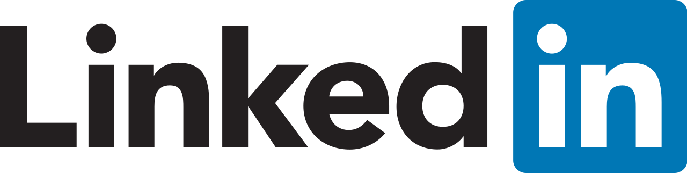

# Galactic Linkedin profile guide

_Welcome to this guide to optimizing your LinkedIn profile! Exactly like the CV guide (which you can find here) the goal is to give you useful hints to make your LinkedIn profile attractive but above all keyword-friendly. Being a professional social network, the purpose of the guide is simple: to get you found (assuming, of course, you want to be found 😜)! If you are not looking for a job, this guide can still be useful for you to better position your profile, make it more professional, and can provide you with some insights and trivia._

  
## Index
  
  
1. [General Info](#1-general-info)
2. [Profile and cover photo](#2-profile-and-cover-photo)
3. [The Headline](#3-the-headline)
4. [About me section](#4-about-me-section)
5. [Professional experiences](5#professional-experiences)
6. [Training experiences](6#training-experiences)
7. [Licenses and certifications](7#licenses-and-certifications)
8. [Skills](8#skills)
9. [Languages](9#languages)
10. [References](10#references)
11. [Final Considerations](11#final-considerations)

  
## 1) General Info
  
LinkedIn, worldwide, has about 830 million active users, including about 16 million in Italy. For the tech industry, it is, without a doubt, the best tool that people working as recruiters/head hunters/talent acquisition use every day to find IT professionals/people. Before we get into the details of the various points of the guide, some general considerations to get you off to the best start:
- I know, a lot of recruiters don't know your environment, the names of technologies/frameworks, confuse Java with Javascript (yes, it still happens) and so on. And that, I guess, pisses you off. BUT, please still try to always be sympathetic and empathetic to those who write to you. Try, as much as possible, to always respond to the messages you receive because on the other side there is still a person who is working and deserves respect just as much as you do. If you are not currently looking for a new job, I suggest perhaps preparing a preset text to send to the person who writes you, to use trivially as a reply. You waste a few seconds of time but I assure you that whoever is on the other end will appreciate it!
- The opentowork issue: surely you think the green #opentowork frame is no big deal, right? And you also think that if you activate it, your company will quickly catch you out and realize that you are looking for a new job. I don't know if you know this, but there is also an option to report that you are opentowork but not to the "public": just click on the "available for" button under your profile picture and, after selecting the "change job" option in the mask that will open to you, scroll down and you will find a menu with the title "choose who can see that you are available for job opportunities" and select "recruiters only": this way recruiters, using Linkedin Recruiter, will see an entry in your profile "available for work". Easy!
- People who search for professionals on Linkedin do so primarily using keywords (keywords), in two ways: either by using Boolean strings (you are a dev, I think it is useless to explain what they are) or by using precisely keywords and other filters with the LinkedIn Recruiter license (Linkedin's paid profile that unlocks a whole host of features, including lots of optimized search filters and more). From here it is clear that EVERYTHING written on your profile is useful in getting you found and, more importantly, targeted in the searches that are conducted on the platform precisely through keywords. However, we will elaborate on this aspect in later sections of this guide.
- LinkedIn, like any other social network, has its own algorithm that regulates what appears in your feed, interactions between members, and more. To maintain a visible and "engaging" profile many online guides recommend posting 3-4 pieces of content per week and leaving at least two comments per day. This, at least, would be the golden rule for keeping a profile "friendly" to the algorithm. That said, you are free to use your profile as you see fit: if you don't have anything interesting to post, you don't have to! The great thing about LinkedIn is precisely the valuable content that is posted. I, for example, post very little (on average, once a week) but on the other hand, I comment a lot and keep alive the many relationships on the platform (even private messages "trigger" the algorithm, did you know that?). So find your personal "tone of voice" and adapt it to what you want to communicate. And remember: not communicating is also communicating 😁.

  <b><a href="#indice">↥ Back To Top</a></b>

## 2) Profile  and cover photo

Compared to the CV, on LinkedIn the profile photo is FUNDAMENTAL (one study reveals that those with a professional profile photo have 20x profile views than those without). Use a professional one (NO grainy photos, NO 20-year-old passport photos, NO beach photos..you get the idea), please. As I wrote in the CV guide, if you don't have a photo even an avatar or illustration is fine. But again, let them be professional, not done with Paint, that is. About the cover image: it is not in my opinion essential but I would use it to give your profile a personalized touch: a piece of code? A famous quote? A meme? Here, you can use the cover image to "convey something" to those who visit your profile. Make use of it!

  <b><a href="#indice">↥ Back To Top</a></b>

## 3) The Headline

Immediately after setting the profile photo and the cover image, you have to pay the utmost attention to this other very important section, namely the headline: it is the text section located immediately below the photo, which usually includes the summary and the current job position. In the image below you will find a very good example, which is the headline of Patryk: a developer who is very active on Linkedin and who in my opinion has an extremely well-maintained profile in all its details.

But why does his headline work? Simple: it provides in a quick but effective way an overview first of the technology stack he uses and knows (in his case for both the FE and BE parts) but also an additional cue about his passion for open source. In addition, and this is a very important thing, all the technologies/frameworks he has included in the headline are keywords (remember? We talked about this in the introduction) so, for example, searching for a dev who knows both Typescript and React, recruiters will definitely land on Patryk's profile because that text in the headline serves as a keyword. Regardless of keywords, the headline is at a glance one of the very first things you notice about the profile: it is a space where you need to be able to communicate in a few lines who you are, what you do (and possibly, what you are looking for). Make the most of it AT MAXIMUM!

  <b><a href="#indice">↥ Back To Top</a></b>

## 4) About me section

Exactly like the about me section on your resume, this section on your profile is most useful for providing an in-depth overview of your work experience, the languages/technologies/frameworks you know and use, future goals, activities you follow on a daily basis, and why not, even information that might not seem very useful (hobbies, what you like to do in your spare time, books you are reading, people you follow, projects you develop in your spare time) but that provides the reader with a more complete and detailed view of you. I give you an example of an extremely detailed information section from a senior dev I have among my contacts:

The information section, as compiled in the example, contains all the information a recruiter needs: a brief description of self and approach to the job, an exhaustive list of technologies/linguistics/frameworks/software/methodologies (and guess what? THEY'RE ALL KEYWORDS! ) and also additional input regarding team management, ability to follow technical interviews, and habit of Agile work. Take a cue!

  <b><a href="#indice">↥ Back To Top</a></b>

## 5) Professional experiences

What to say about this section? It is by far one of the most important in the entire profile (if not THE most important). Some helpful hints about it:
- Try to make the most of the "Description" field when entering or editing a work experience. By now you've probably figured out that all the text on the profile does keyword, so use this field to briefly describe what you do at the company, the duties, daily tasks, technologies, and the job sector of the company you work for.
Hook skills to the job position: we will see this in the dedicated section later, but writing skills on the profile is FUNDAMENTAL for getting found by recruiters. Therefore, pegging skills to the job you are currently doing (or have done previously) is most useful for demonstrating a professional "history" consistent with what you currently do or what you have done previously.
- Try to "hook" the name of the company you work for correctly. I often find profiles with blatant typos about the company you work for, consequently LinkedIn does not show the correct company logo. As a result, a recruiter who, for example, wants to go and read about what the company is about, the industry, size, and more, trivially will not be able to do so. So take care to correctly select the company you are working for-it is so important!
- Content is king: I will be redundant, but the more information you write on the profile the better: better a well-edited profile with lots of information than a bare, empty one. I assure you that the effort on filling out one's profile is noticed!

  <b><a href="#indice">↥ Back To Top</a></b>

 

## 6) Training Experiences

The education section of the LinkedIn profile is often overlooked, but it is actually just as important as the other sections. It is one of the sections, in fact, that is "read" by the various Linkedin Recruiter filters when recruiters set up a targeted search (for example: a specific degree, a particular university, or a specific address). So pay close attention to this section and fill it out thoroughly. Then enter the name of the faculty, the address you have chosen, the grade of your degree, and the names of the exams that you think might be related to your career path.
If you are attending an IT Academy/Bootcamp, obviously entering it will make you appear as a student at that academy, and it certainly helps in indexing your profile (also because, by writing keywords related to the technologies/languages you are studying, you will put additional keywords on your profile that, as you may have guessed, are crucial).

  <b><a href="#indice">↥ Back To Top</a></b>

## 7) Licenses and Certifications

Personally, this is one of the sections I read with the most interest and curiosity on the Linkedin profiles I visit (but I'm a strange animal, I love reading the hobbies section on the CV so I probably do little reading). Please note: I am not a technician, consequently I cannot carp about the real "technical value" of x rather than y certification but, the fact that I have certifications, certificates and licenses denotes a certain approach to self-training which in my opinion is a plus. Okay, some companies require mandatory certifications (I'm thinking for example of Green Belt Six Sigma, which is now a must for the basics of a good project manager, or AWS/Azure/Google Cloud certifications) to access their selections or for career advancement, and that fits.

But very often, however, there is no obligation for a/an individual professional to certify and train, it is simply up to the individual's willingness to increase their skills and knowledge in an "official" way, with a certifcate or specific license. This, personally, I greatly appreciate and find a great conversation starter during interviews. Consequently, this section is absolutely appropriate for showcasing your propensity for learning and professional growth.

  <b><a href="#indice">↥ Back To Top</a></b>

## 8) Skills

One thing I notice EXTREMELY on the LinkedIn profiles I visit daily is the lack of care for this section, which is actually SUPER SUPER important, along with the section on professional experience. What is the word I have widely abused in this guide? KEYWORD. Here, it is exactly the skills section that definitely feeds into your appearing (or not) among recruiters' searches.

The skills section MUST be maintained and kept in order for several reasons, I'll explain how:
- Constantly update the section, eliminating technologies/lingues/frameworks that you no longer use (or that you know but no longer want to use professionally) to avoid receiving job proposals with technologies you are not interested in.
- One very important thing is to sort skills: put the skills you are strongest on at the top and those where you feel least competent at the end.
LinkedIn gives you the ability to "highlight" your top three skills, which will immediately appear on your profile: so linking back to the previous point, pick the three skills where you feel most skilled and move them to the top.
- We had also talked about skills in point 5, professional experiences: LinkedIn allows you to "tie" skills to professional experience, which is super useful for demonstrating what skills you are using in your current role.
- Ask colleagues/friends/connections to confirm competencies for you: it's obviously a pure vanity metric but you probably know better than I do that the "wow effect" of seeing a competency confirmed by lots of people works, so do it!

  <b><a href="#indice">↥ Back To Top</a></b>

## 9) Languages

Exactly as with the CV, the languages section provides the possibility to communicate your knowledge of one or more languages other than your mother tongue (in our case, of course, Italian). For example, it happens to me to manage selections where knowledge of English is absolutely compulsory (because maybe the team is international, the company has foreign clients, is expanding outside Italy, etc.), consequently demonstrating a knowledge of a foreign language helps me to understand if the profile I am visiting meets that requirement. If you have language certifications or certificates, it is absolutely great to put them in the section we talked about earlier, which is "Licenses and Certifications."

  <b><a href="#indice">↥ Back To Top</a></b>

## 10) References

Here's another section I love to visit (yes, I'm weird, this confirms it). Reviews are a very powerful weapon that very few people really take advantage of. It's impossible not to have a colleague, manager, former boss, collaborator, outside consultant from whom you can ask for a reference (unless you're the Grinch and have no friends, of course). It really is a request that costs a few minutes and helps so much to enrich your profile and increase your personal branding.

Fun fact: While visiting a developer's profile (which, at first glance, didn't particularly appeal to me) I noticed that he had received a reference from a high-level manager I know well. The reference then prompted me to investigate further, contacting the developer who, in fact, during the interview confirmed the attitude and skills that the positive reference he had received from the manager reported. Probably, had that reference not been there, I would never have contacted him!

  <b><a href="#indice">↥ Back To Top</a></b>

## 11) Final considerations

If you have made it this far, I thank you, because as you can see, the gift of brevity does not belong to me (you probably also noticed this when reading the CV guide, which is even longer than this one). In fact, for the sake of the record, I have voluntarily omitted a great many other LinkedIn topics and features that I think are interesting and extremely useful (who visited your profile, organic post views, the use of hashtags, the profile creator, the algorithm, linking in the post and in comments, and much more), but I have done so simply for a practical reason, which is to try not to burden this guide with excessive notionism or vertical technicalities of the platform. I know, you're a dev, you probably wallow in technicalities, and you're also right! But, there you go, the goal is to make these guides usable and "readable" without getting too technical and lapsing into utter boredom.

If you haven't fallen asleep, thanks again!

  <b><a href="#indice">↥ Back To Top</a></b>

